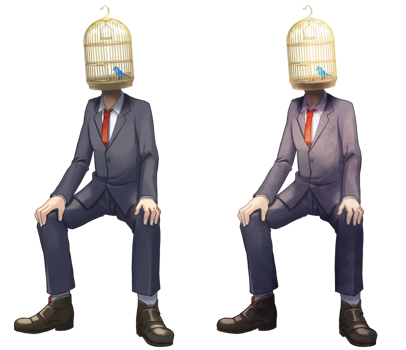
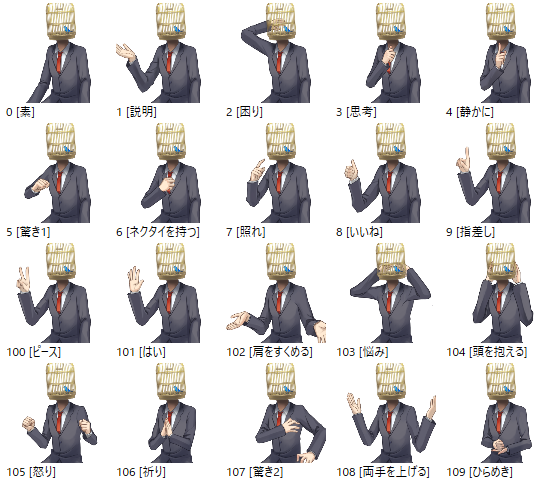
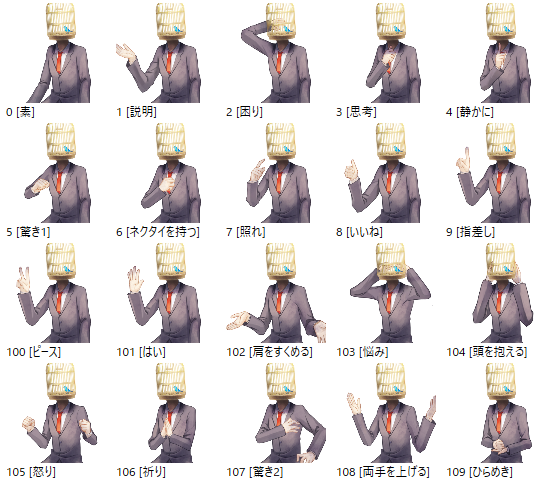

# 鳥籠頭と青い鳥

## これは何？

伺か用フリーシェル(立ち絵)「鳥籠頭と青い鳥」の公開レポジトリです。

青い鳥が入った鳥籠の頭を持つ男性のフリーシェルで、SSP専用です。
簡単なオーナードローメニュー素材がついています。

シェルやpsdファイルのダウンロードは
[`Releasesの最新版`](https://github.com/tukinami/cage_head_with_blue_bird/releases/latest)からどうぞ。

## ダウンロードできる内容は？

通常は`cage_head_with_blue_bird.nar`か`cage_head_with_blue_bird_arranged.nar`、
どちらかをダウンロードしてください。

### cage\_head\_with\_blue\_bird.nar

フリーシェル本体(通常版)です。
名前は「鳥籠頭と青い鳥」で、縦700pxです。

### cage\_head\_with\_blue\_bird\_arranged.nar

フリーシェル本体(アレンジ版)です。
名前は「鳥籠頭と青い鳥:篝火」で、縦700pxです。

### cage\_head\_with\_blue\_bird-psd.zip

シェル改変のために用意したpsdファイルです。シェル本体と青い鳥の切り抜きが入っています。

## シェル画像のプレビュー

左が通常版の「鳥籠頭と青い鳥」、右がアレンジ版の「鳥籠頭と青い鳥:篝火」です。(50%縮小)

表情集(通常版)

表情集(アレンジ版)

## 当たり判定

- Head
- Shoulder
- Hand
- Tie

当たり判定上ではマウスカーソルが変わるように設定されています。

## ライセンス

[CC BY 4.0](https://creativecommons.org/licenses/by/4.0/) にて配布いたします。
([日本語版ライセンス](https://creativecommons.org/licenses/by/4.0/deed.ja))

## 連絡先

- [Peing質問箱](https://peing.net/ja/tukinami_seika)
- [Mastodon(fedibird)](https://fedibird.com/@tukinami_seika)
- [Mastodon(うかどん)](https://ukadon.shillest.net/@tukinami_seika)

## 製作者

月波 清火

- [GitHub](https://github.com/tukinami)
- [github.io(これまで公開した制作物)](https://tukinami.github.io)
